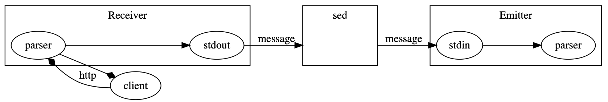

# pipe-webserver

A web-server written in Deno using unix pipelines.

## Summary

One of the most interesting things about UNIX is the ways of working that arised from the unix phylosophy, for instance the principle that a program should do one thing and only one thing well, but in the age of internet, we saw ever more complicated webservers arise.

Be it apache,nginx iis or tomcat the truth is they do a lot more than serving webpages. they parse, zip, process, add headers, check security, route requests, adapt templates, do ssl and even manage other sub processes through the way of workers and process management using fast-cgi or other APIs.

This is a project that tries to follow the principles and create a webserver that is based on nothing more than open standards and the pure unix phylosophy.

As summarized by Peter H. Salus in A Quarter-Century of Unix (1994):

* Write programs that do one thing and do it well.
* Write programs to work together.
* Write programs to handle text streams, because that is a universal interface.

Each process should do 1 thing and 1 thing well, the API between the processes will be open and versioned from the start, making sure that mixing and matching components will not break functionality, this makes developing programs a lot simpler.

## API

The processes share requests one line at the time, the request is a [NDJSON](http://ndjson.org/) document following a json schema, see the version 1 for details.

## Programs

The programs can be any linux executable which works with text, some basic programs are provided to give a basic http1.0 webserver implementation from the start.

The initial programs are written for [Deno](https://github.com/denoland/deno) since the deno sandbox disallows access to the external resources by default which is great for security reasons, this lets you control security per process and only allow the ```receiver``` and ```emmiter``` programs to connect to the internet.

## Arquitecture



Processes can be programmed in any language and can only talk through standard unix pipelines and should start with a receiver program (which translates the http request to the document) and end with and emitter (responsible to send the ending request back to the client)

Other than this two processes the order of the programs in the pipeline is not in any way enforced and can be changed in any combination possible.

Even though the messages are processed in a synchronized way nothing prevents the processes from treating them asynchronously or even prevent some of them from reaching the end of the pipeline, all requests without reply will be canceled after 5 seconds and return 503 to the client. 

The applications print to the standard error output other messages for debugging purposes.

## Examples

### Example 1

Receive requests on the default port pass them through a filter ("that marks the request as filtered") and return a response to the user

```sh
$ receiver | filter | emitter
```

This example is implemented in the ```Dockerfile.example1``` file.

To build: ```$ docker build -f Dockerfile.example1 -t server .```

Then to run: ```$ docker run -p 8000:8000 server```

### Example 2

Receive requests on the default port pass them through a filter ("that marks the request as filtered") and return a response to the user

```sh
$ receiver | filter --filterUrl="/helloworld" | hello-world | emitter
```

This example is implemented in the ```Dockerfile.example2``` file.

To build: ```$ docker build -f Dockerfile.example2 -t server .```

Then to run: ```$ docker run -p 8000:8000 server```

### Example 3

Receive requests on the default port pass them through sed ("that writes hello world in the body") and return a response to the user.

```sh
$ receiver | \
  sed 's/}$/body:"<h1>Hello world</h1>"}/g' | \
  emmiter 
```

### Example 4

Receive requests on the default port, log the requests, pass them through sed ("that writes hello world in the body"), log the reply and return a response to the user.

```sh
$ receiver | \
  tee access.log | \
  sed 's/"reply":{}/"reply":{"body":"<h1>This response is being logged</h1>"}/g' | \
  tee response.log | \
  emmiter 
```

## Features and TODO list

Tasks strikedthrough are already done, others are in the roadmap.

* ~~Create the request API 0.1 schema~~
* ~~Implement the "Receiver" program~~
* ~~Implement the "Emitter" program~~
* ~~Create an basic example of an http server that receives a input text and replies with "Hello world"~~
* ~~Create an example of the same program but logging the events to an external file. ( access.log )~~
* ~~Add docker files with examples of the webservers~~
* ~~Implement a "Filter" program~~
* ~~Create an example of a program that filters the given requests and only allow for a given url to reply to the user.~~
* Implement a "Blog" program ( replies with a given html markdown )
* Implement a "Router" program
* Create the request API 0.2 schema
* Implement a "Redirect" program

## Features that will not be considered or not part of the design

* SSL/TLS implementation - just use stunnel4 a great program which already follows the unix way.
* Websockets and other "stream" based apis - makes no sense to be controlled by pipelines.
* Logging - there's already a lot of great tools to do this job.

