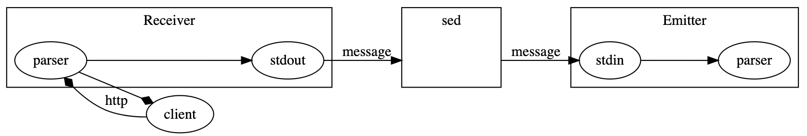
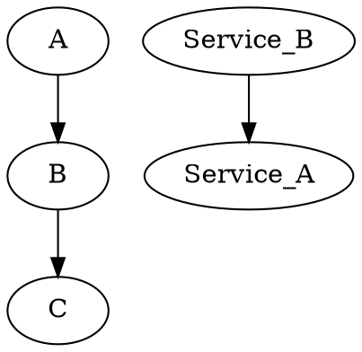

# Test

## Table of contents here

<div class="toc"></div>

## Actual content

Let's try to edit this from vim

And then open it in some other browser



- Add some fun features
- A lot of things to do

{!./subfolder/subfile.md!}

> A simple graph



> How to print the NDJSON message between 2 steps to the terminal

```bash
$ echo "the easiest way to see the messages in-between steps using tee"
$ receiver | favicon | blog | tee /dev/stderr | emitter
```

# Video page

## Embedded video

[youtube video](https://www.youtube.com/watch?v=UrYPbF8_xNk)
[youtube video](https://www.youtube.com/watch?v=dXMHf57xs5M)

```java
class SystemClass {
	public static main(String[]: args){
		System.out.println("Hello World");
	}
}
```

## Code stuff

<details>
<summary>Here's some collapsible code hidden under a summary...</summary>
<p>

```c#
public class Order
{
    public int OrderId { get; set; }
    public int CustomerId { get; set; }

    public List<int> Products { get; set; }
}
```

</p>
</details>

And here's some code I'm currently working on:

{!shortcuts.vim!code!vim!}

## Checkboxes

- [ ] No deal
- [x] Deal
- [ ] Sell your soul
- ✅ This one?
- ☑️ Or this one?
- 🔲 Empty...

## Forms?

<form method="post">
        <label>Name here:</label>
        <input type="text" id="textbox" name="textbox"><br>
        <label>Phone here:</label>
        <input type="text" id="phone" name="phone"/><br>
        <input type="submit" value="Submit">
</form>

{!footer.md!}
