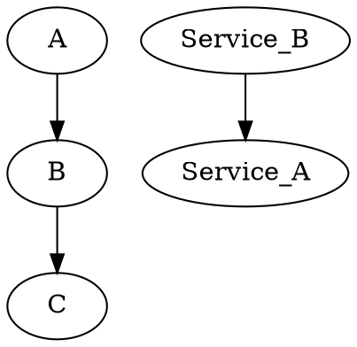

# Test

## Table of contents here

<div class="toc"></div>

## Actual content

Let's try to edit this from vim

And then open it in some other browser


- Add some fun features
- A lot of things to do

{!./subfolder/subfile.md!}

> A simple graph



> How to print the NDJSON message between 2 steps to the terminal

```bash
$ echo "the easiest way to see the messages in-between steps using tee"
$ receiver | favicon | blog | tee /dev/stderr | emitter
```

# Video page

## Embedded video

[youtube video](https://www.youtube.com/watch?v=UrYPbF8_xNk)

```java
class SystemClass {
	public static main(String[]: args){
		System.out.println("Hello World");
	}
}
```

{!footer.md!}
